# Seguridad de Red con VLAN, DMZ y ACLs

Diseño e implementación de una arquitectura de red segmentada mediante VLANs, zona desmilitarizada (DMZ) y listas de control de acceso (ACLs), usando Cisco Packet Tracer.

---

## Índice

- [Topología](#topología)
- [Direccionamiento IP](#direccionamiento-ip)
- [Configuración del servidor](#configuración-del-servidor)
- [Configuración de VLANs](#configuración-de-vlans)
- [Configuración del Router](#configuración-del-router)
- [Configuración del Firewall ASA](#configuración-del-firewall-asa)

---

## Topología

La red se divide en tres zonas bien diferenciadas:

- **Red interna:** contiene los equipos de tres departamentos (Finanzas, Administración e Informática), distribuidos en dos switches y segmentados mediante VLANs. Un router actúa como intermediario hacia el firewall.
- **DMZ:** aloja el servidor web, conectado a un switch independiente.
- **Red externa:** representa internet, con un PC cliente para validar el acceso público al servidor.

El firewall ASA 5506 hace de frontera entre las tres zonas, aplicando políticas de seguridad diferenciadas por nivel de confianza.

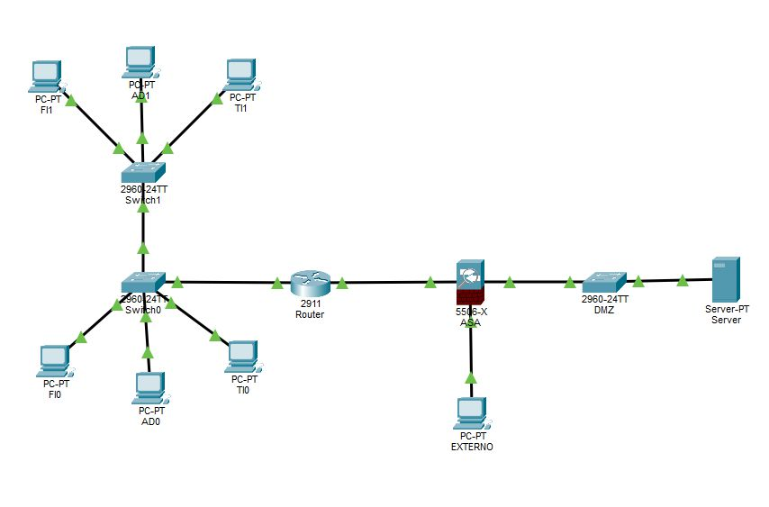

---

## Direccionamiento IP

### Equipos internos

| Dispositivo | IP             | Máscara           | Gateway          |
|-------------|----------------|-------------------|------------------|
| FI0         | 192.168.16.2   | 255.255.255.0     | 192.168.16.1     |
| FI1         | 192.168.16.3   | 255.255.255.0     | 192.168.16.1     |
| AD0         | 192.168.17.130 | 255.255.255.224   | 192.168.17.129   |
| AD1         | 192.168.17.131 | 255.255.255.224   | 192.168.17.129   |
| TI0         | 192.168.17.2   | 255.255.255.128   | 192.168.17.1     |
| TI1         | 192.168.17.3   | 255.255.255.128   | 192.168.17.1     |

### Otros dispositivos

| Dispositivo   | IP            | Máscara         | Gateway        |
|---------------|---------------|-----------------|----------------|
| PC Externo    | 192.168.2.2   | 255.255.255.0   | 192.168.2.1    |
| Servidor Web  | 192.168.3.2   | 255.255.255.0   | 192.168.3.1    |

### Subredes destacadas

| Zona / Enlace         | Red                  |
|-----------------------|----------------------|
| Finanzas (VLAN 10)    | 192.168.16.0/24      |
| Informática (VLAN 30) | 192.168.17.0/25      |
| Administración (VLAN 20) | 192.168.17.128/27 |
| Enlace Router–Firewall | 192.168.17.160/30   |
| Red externa           | 192.168.2.0/24       |
| DMZ                   | 192.168.3.0/24       |

---

## Configuración del servidor

El servidor web ubicado en la DMZ ofrece dos servicios:

**FTP:** se crea un usuario con permisos completos (RWDNL).

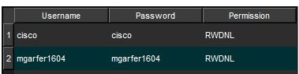

**HTTP:** se personaliza el archivo `index.html`.

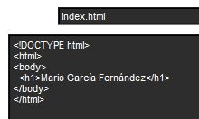

---

## Configuración de VLANs

Se crean tres VLANs para segmentar el tráfico por departamento:

| VLAN | Nombre         |
|------|----------------|
| 10   | Finanzas       |
| 20   | Administración |
| 30   | Informática    |

Los puertos de acceso de cada switch se asignan a la VLAN correspondiente y los puertos de uplink se configuran en modo trunk.

**Switch 0** (planta baja):

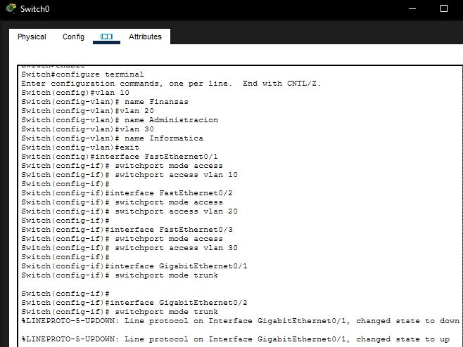

**Switch 1** (planta superior):

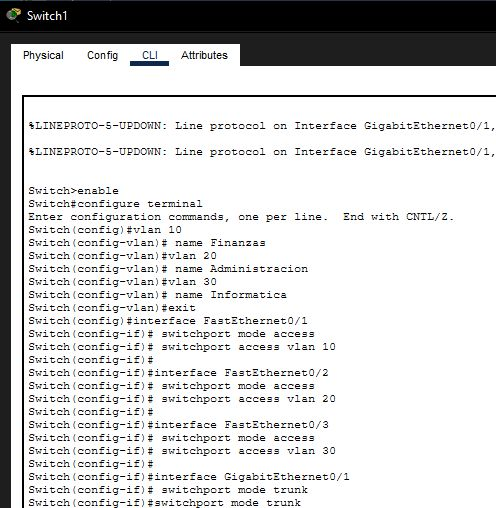

---

## Configuración del Router

### Subinterfaces para inter-VLAN routing

El router recibe el tráfico de los tres departamentos por una única interfaz física configurada con subinterfaces dot1Q, actuando como *router-on-a-stick*:

```
interface GigabitEthernet0/0
 no shutdown

interface GigabitEthernet0/0.10
 encapsulation dot1Q 10
 ip address 192.168.16.1 255.255.255.0

interface GigabitEthernet0/0.20
 encapsulation dot1Q 20
 ip address 192.168.17.129 255.255.255.224

interface GigabitEthernet0/0.30
 encapsulation dot1Q 30
 ip address 192.168.17.1 255.255.255.128
```

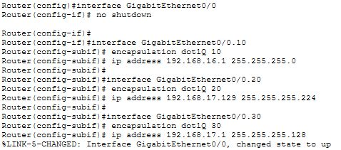

### Enlace hacia el firewall y ruta por defecto

```
interface GigabitEthernet0/1
 ip address 192.168.17.161 255.255.255.252
 no shutdown

ip route 0.0.0.0 0.0.0.0 192.168.17.162
```

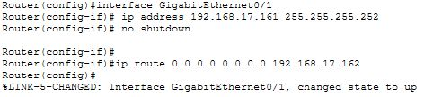

### ACL en el router

Se aplica una ACL extendida sobre la interfaz interna para controlar el tráfico de los empleados:

- Todos los departamentos pueden acceder al servidor web (HTTP).
- Finanzas y Administración solo pueden hacer ping dentro de su propia subred.
- Informática puede hacer ping a cualquier subred y al servidor, y además acceder por FTP.
- Se permiten las respuestas ICMP (echo-reply) en cualquier dirección.

```
ip access-list extended ACL-EMPLEADOS
 permit tcp 192.168.16.0 0.0.0.255 host 192.168.3.2 eq 80
 permit tcp 192.168.17.0 0.0.0.127 host 192.168.3.2 eq 80
 permit tcp 192.168.17.128 0.0.0.31 host 192.168.3.2 eq 80
 permit icmp 192.168.16.0 0.0.0.255 192.168.16.0 0.0.0.255
 permit icmp 192.168.17.128 0.0.0.31 192.168.17.128 0.0.0.31
 permit icmp 192.168.17.0 0.0.0.127 any
 permit tcp 192.168.17.0 0.0.0.127 host 192.168.3.2 eq 21
 permit icmp any any echo-reply
 deny ip any any

interface GigabitEthernet0/0
 ip access-group ACL-EMPLEADOS in
```

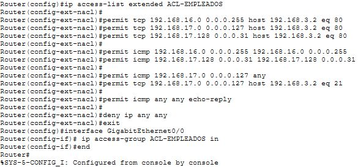

---

## Configuración del Firewall ASA

### Interfaces y niveles de seguridad

El ASA 5506 separa las tres zonas con los siguientes niveles de confianza:

| Interfaz          | Nombre  | Nivel | IP                        |
|-------------------|---------|-------|---------------------------|
| GigabitEthernet1/1 | inside | 100   | 192.168.17.162/30         |
| GigabitEthernet1/2 | dmz    | 50    | 192.168.3.1/24            |
| GigabitEthernet1/3 | outside| 0     | 192.168.2.1/24            |

```
interface GigabitEthernet1/1
 nameif inside
 security-level 100
 ip address 192.168.17.162 255.255.255.252
 no shutdown

interface GigabitEthernet1/2
 nameif dmz
 security-level 50
 ip address 192.168.3.1 255.255.255.0
 no shutdown

interface GigabitEthernet1/3
 nameif outside
 security-level 0
 ip address 192.168.2.1 255.255.255.0
 no shutdown
```

### Rutas de retorno hacia las subredes internas

```
route inside 192.168.16.0 255.255.255.0 192.168.17.161
route inside 192.168.17.0 255.255.255.128 192.168.17.161
route inside 192.168.17.128 255.255.255.224 192.168.17.161
```

### NAT estático para el servidor web

Se traduce la IP privada del servidor a la IP pública del firewall para hacerlo accesible desde el exterior:

```
object network SERVIDOR-WEB
 host 192.168.3.2
 nat (dmz,outside) static 192.168.2.10
```

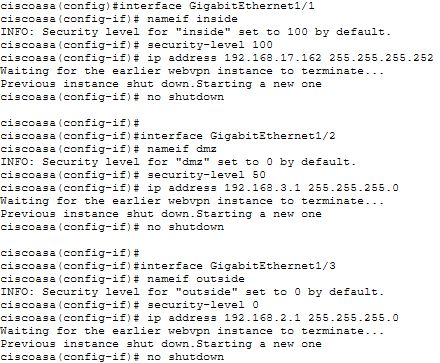

### ACLs en el firewall

Se definen tres ACLs, una por zona, que se aplican en la interfaz de entrada correspondiente:

**ACL-OUTSIDE** (tráfico entrante desde internet):
- Solo se permite HTTP hacia la IP pública del servidor.

**ACL-INSIDE** (tráfico entrante desde la red interna):
- Los tres departamentos pueden acceder al servidor por HTTP (IP privada).
- Solo Informática puede acceder por FTP y hacer ping al servidor.

**ACL-DMZ** (tráfico saliente desde la DMZ):
- El servidor puede responder HTTP a los tres departamentos.
- Solo puede responder FTP y echo-reply al departamento de Informática.

```
access-list ACL-OUTSIDE extended permit tcp any host 192.168.2.10 eq 80

access-list ACL-INSIDE extended permit tcp 192.168.16.0 255.255.255.0 host 192.168.3.2 eq 80
access-list ACL-INSIDE extended permit tcp 192.168.17.0 255.255.255.128 host 192.168.3.2 eq 80
access-list ACL-INSIDE extended permit tcp 192.168.17.128 255.255.255.224 host 192.168.3.2 eq 80
access-list ACL-INSIDE extended permit tcp 192.168.17.0 255.255.255.128 host 192.168.3.2 eq 21
access-list ACL-INSIDE extended permit icmp 192.168.17.0 255.255.255.128 host 192.168.3.2 echo

access-list ACL-DMZ extended permit tcp host 192.168.3.2 192.168.16.0 255.255.255.0 eq 80
access-list ACL-DMZ extended permit tcp host 192.168.3.2 192.168.17.0 255.255.255.128 eq 80
access-list ACL-DMZ extended permit tcp host 192.168.3.2 192.168.17.128 255.255.255.224 eq 80
access-list ACL-DMZ extended permit tcp host 192.168.3.2 192.168.17.0 255.255.255.128 eq 21
access-list ACL-DMZ extended permit icmp host 192.168.3.2 192.168.17.0 255.255.255.128 echo-reply

access-group ACL-OUTSIDE in interface outside
access-group ACL-INSIDE in interface inside
access-group ACL-DMZ in interface dmz
```

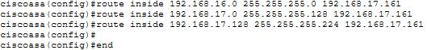

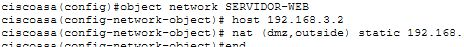

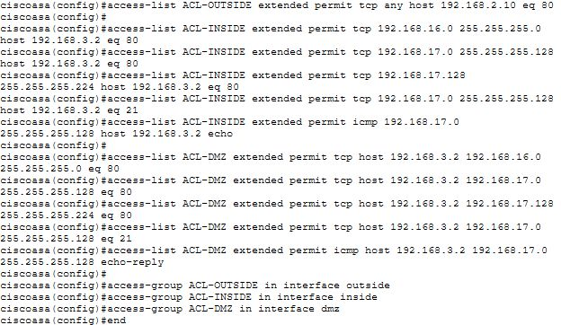

---

## Archivos del proyecto

| Archivo | Descripción |
|--------|-------------|
| `Seguridad_RED.pkt` | Simulación completa en Cisco Packet Tracer |
| `Seguridad_RED.pdf` | Documentación detallada con capturas |
| `images/` | Capturas de pantalla referenciadas en este documento |

---

## Herramientas utilizadas

- Cisco Packet Tracer
- Cisco IOS (Router 2911)
- Cisco ASA 5506-X

