# IDS - Detección de Fuerza Bruta con n8n

## Introducción

Este sistema detecta ataques de fuerza bruta sobre servicios de autenticación. Un ataque de fuerza bruta ocurre cuando un actor malicioso intenta acceder a un sistema probando múltiples combinaciones de credenciales de forma automatizada y repetitiva. Es uno de los vectores de ataque más comunes y puede derivar en acceso no autorizado, escalada de privilegios y compromiso total del sistema.

El caso concreto que se simula es el de una IP externa que realiza múltiples intentos de login fallidos contra un servicio SSH corporativo en un período corto de tiempo, comportamiento típico de herramientas automatizadas como Hydra o Medusa.

---

## Lógica de detección

  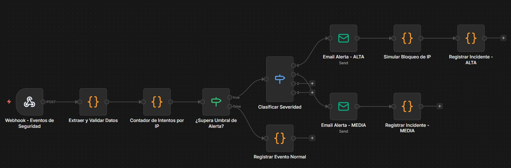

El workflow se compone de los siguientes nodos:

**Webhook - Eventos de Seguridad:** punto de entrada del sistema. Escucha peticiones POST en `/webhook/security-events` con información del intento de acceso (IP, usuario, servicio, éxito o fallo).

**Extraer y Validar Datos:** normaliza el payload entrante, independientemente de su estructura. Comprueba que el campo `ip` esté presente, ya que es obligatorio para el funcionamiento del sistema.

**Contador de Intentos por IP:** núcleo del sistema de detección. Utiliza `$getWorkflowStaticData` para persistir los contadores entre distintas ejecuciones del workflow. Si el login es exitoso, resetea el contador de esa IP. Si es fallido, incrementa el contador y registra la marca de tiempo del primer y último intento.

**¿Supera Umbral de Alerta?:** nodo IF que comprueba si el número de intentos fallidos es igual o superior a 5. Si no supera el umbral, el evento se registra como normal y el flujo termina. Si lo supera, pasa al siguiente nodo.

**Clasificar Severidad:** nodo Switch que diferencia entre dos niveles de alerta evaluando el contador de intentos: ALTA para 10 o más intentos, MEDIA para entre 5 y 9.

**Email Alerta - ALTA / MEDIA:** envía una notificación por email al equipo SOC a través de MailHog con los detalles del incidente. El email de severidad ALTA incluye cabecera roja y la confirmación del bloqueo automático; el de severidad MEDIA incluye cabecera naranja y avisa de que la IP está siendo monitorizada.

**Simular Bloqueo de IP:** en caso de severidad ALTA, registra el bloqueo de la IP en el staticData del workflow con una expiración de 24 horas. En un entorno real, este nodo realizaría una llamada a la API del firewall.

**Registrar Incidente - ALTA / MEDIA:** genera un objeto de incidente estructurado con todos los datos relevantes (ID único, severidad, tipo, IP, usuario, servicio, intentos, timestamps y acciones tomadas) y lo registra en el log de ejecución de n8n.

**Registrar Evento Normal:** cuando no se supera el umbral, registra el evento como informativo indicando cuántos intentos lleva esa IP de los 5 necesarios para disparar la alerta.

---

## Justificación de los criterios utilizados

**Umbral de 5 intentos para alerta MEDIA:** el estándar NIST SP 800-63B recomienda bloquear tras 10 intentos, pero notificar antes permite al equipo de seguridad investigar sin esperar al bloqueo. Con 5 intentos fallidos ya es razonable sospechar comportamiento automatizado, ya que un usuario legítimo raramente supera 2 o 3 errores seguidos.

**Umbral de 10 intentos para severidad ALTA y bloqueo automático:** con 10 intentos fallidos consecutivos desde la misma IP la probabilidad de ataque automatizado es muy elevada. El bloqueo automático de 24 horas es proporcional: suficientemente largo para detener el ataque pero reversible, evitando bloqueos accidentales permanentes.

**Reset del contador en login exitoso:** si una IP consigue autenticarse correctamente, significa que el usuario es legítimo y simplemente olvidó su contraseña. Mantener el contador activo tras el éxito generaría falsos positivos en futuros accesos desde esa misma IP.

**Persistencia con staticData:** a diferencia de variables en memoria que se perderían entre peticiones, `$getWorkflowStaticData` permite acumular los intentos de distintas peticiones HTTP separadas en el tiempo, simulando fielmente el comportamiento de un IDS real.

---

## Instrucciones para probar el workflow

**Requisitos previos:**

Levantar el entorno con el siguiente comando:

```bash
docker-compose -f dc-n8n.yml up -d
```

Servicios disponibles una vez arrancado:

- n8n: http://localhost:5678
- MailHog (bandeja de entrada): http://localhost:8025
- PostgreSQL: localhost:5432 (usuario: n8n_user, contraseña: n8n_pass)

**Pasos de configuración:**

1. Abrir n8n en http://localhost:5678 e iniciar sesión
2. Importar el fichero `IDS_FuerzaBruta.json` desde Workflows → Import from file
3. Abrir el nodo Email Alerta - MEDIA, hacer clic en el lápiz junto al campo de credencial SMTP y rellenar: Host `mailhog`, Port `1025`, sin SSL, sin usuario ni contraseña
4. Asignar esa misma credencial al nodo Email Alerta - ALTA
5. Hacer clic en Publish para activar el workflow

**Prueba 1 — Intentos normales sin alerta (intentos 1 a 4):**

```bash
for i in {1..4}; do
  curl -s -X POST http://localhost:5678/webhook/security-events \
    -H "Content-Type: application/json" \
    -d '{"ip":"192.168.1.100","username":"admin","success":false,"service":"SSH"}'
  echo "Intento $i enviado"
done
```

  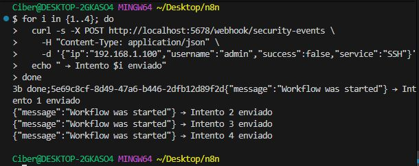
  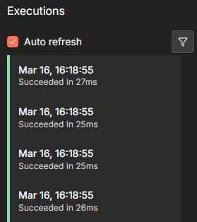

**Prueba 2 — Disparar alerta de severidad MEDIA (intento 5):**

```bash
curl -X POST http://localhost:5678/webhook/security-events \
  -H "Content-Type: application/json" \
  -d '{"ip":"192.168.1.100","username":"admin","success":false,"service":"SSH"}'
```

  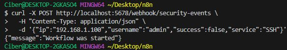
  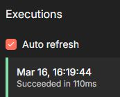
  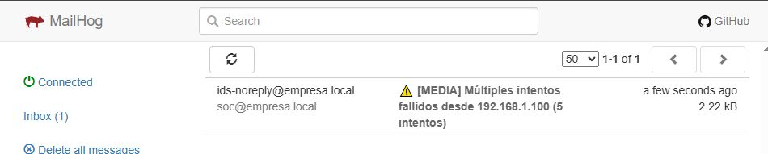

**Prueba 3 — Disparar alerta ALTA y bloqueo automático (intentos 6 a 10):**

```bash
for i in {1..5}; do
  curl -s -X POST http://localhost:5678/webhook/security-events \
    -H "Content-Type: application/json" \
    -d '{"ip":"192.168.1.100","username":"admin","success":false,"service":"SSH"}'
  sleep 0.3
done
```

  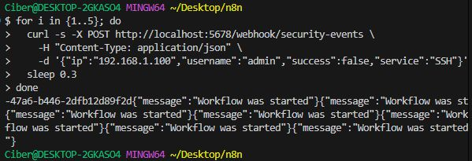
  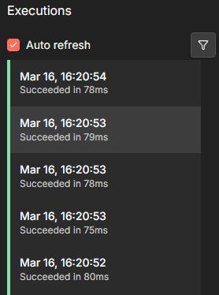
  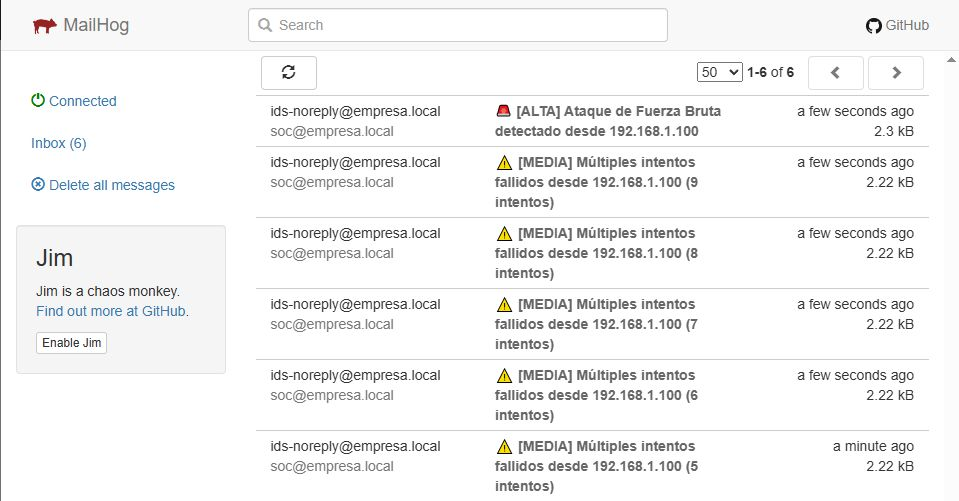

**Prueba 4 — Login exitoso, resetea el contador:**

```bash
curl -X POST http://localhost:5678/webhook/security-events \
  -H "Content-Type: application/json" \
  -d '{"ip":"192.168.1.100","username":"admin","success":true,"service":"SSH"}'
```

  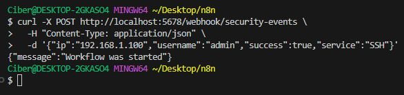
  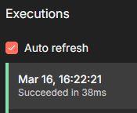

---

## Reflexión sobre posibles mejoras

**Bloqueo real de IP:** el bloqueo actual es simulado en memoria. En un entorno de producción este nodo realizaría una llamada a la API de un firewall real (iptables vía SSH, Cloudflare WAF o grupos de seguridad de AWS/Azure).

**Persistencia en base de datos:** los contadores actuales se almacenan en staticData y se perderían si el contenedor se reinicia. Migrarlos a la base de datos PostgreSQL ya disponible en el entorno garantizaría su durabilidad y permitiría consultas históricas.

**Ventana temporal:** el sistema actual acumula intentos indefinidamente. Sería más preciso contar solo los intentos ocurridos en los últimos N minutos, ignorando fallos muy espaciados en el tiempo que probablemente correspondan a usuarios legítimos.

**Detección de ataques distribuidos:** un atacante sofisticado puede repartir los intentos entre múltiples IPs para evadir la detección. Añadir lógica que cuente intentos por nombre de usuario independientemente de la IP detectaría ataques de credential stuffing.

**Enriquecimiento con inteligencia de amenazas:** integrar una consulta a la API pública de AbuseIPDB permitiría saber si la IP atacante ya tiene historial de actividad maliciosa reportado por otros en internet, aumentando la fiabilidad de la detección.

**Escalado automático:** si la misma IP genera incidentes de severidad ALTA en varios días consecutivos, el sistema podría escalar automáticamente abriendo un ticket en Jira o enviando una notificación adicional al responsable de seguridad.
