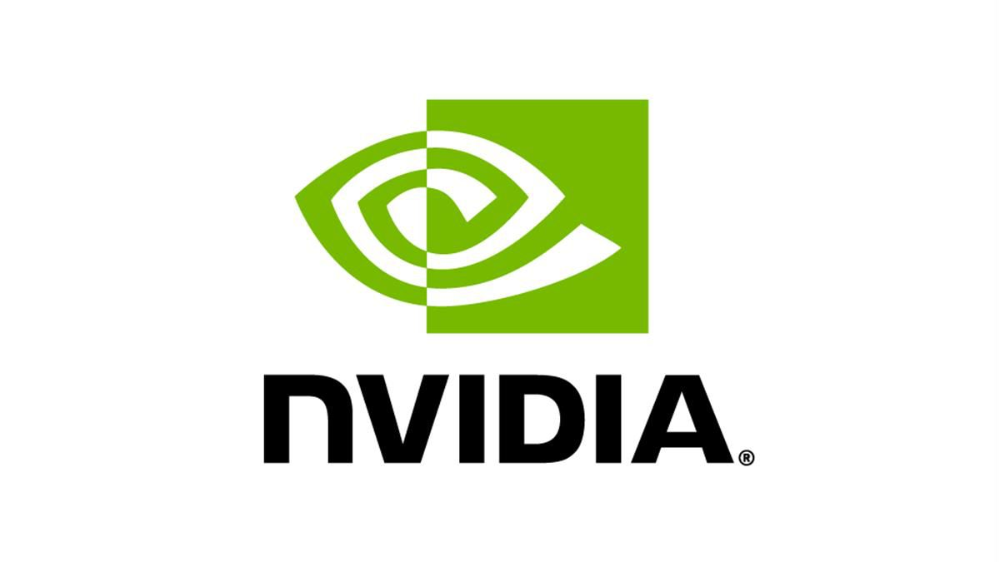
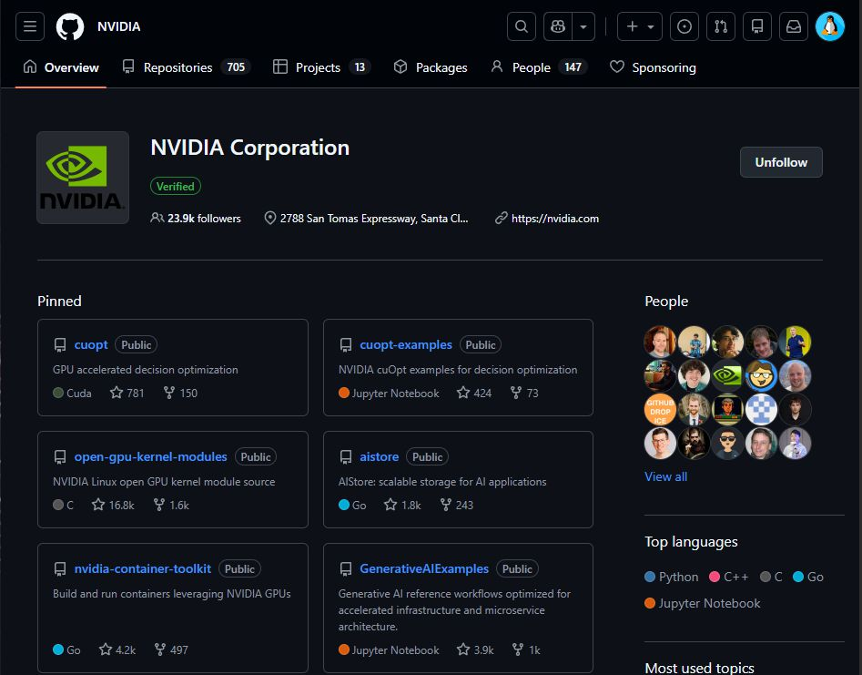
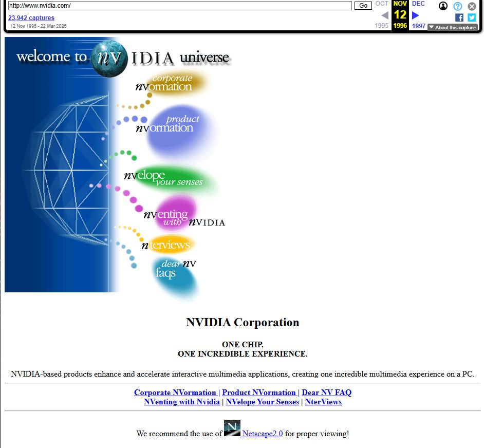
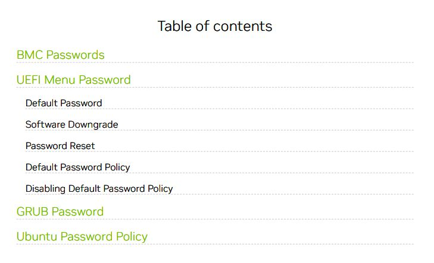
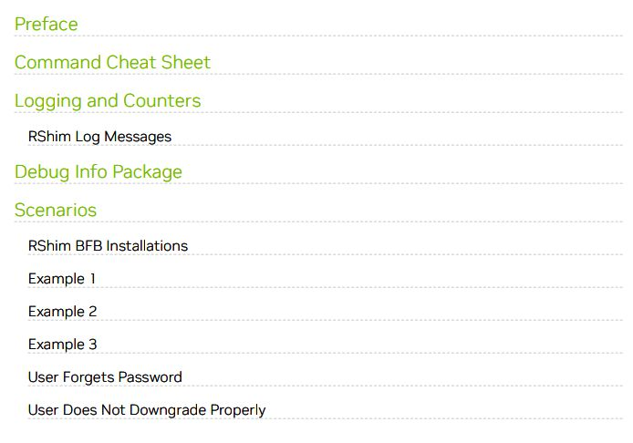
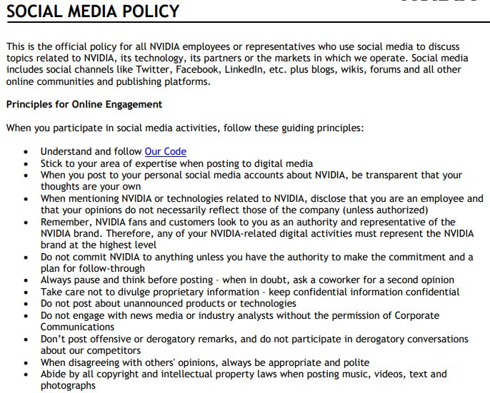
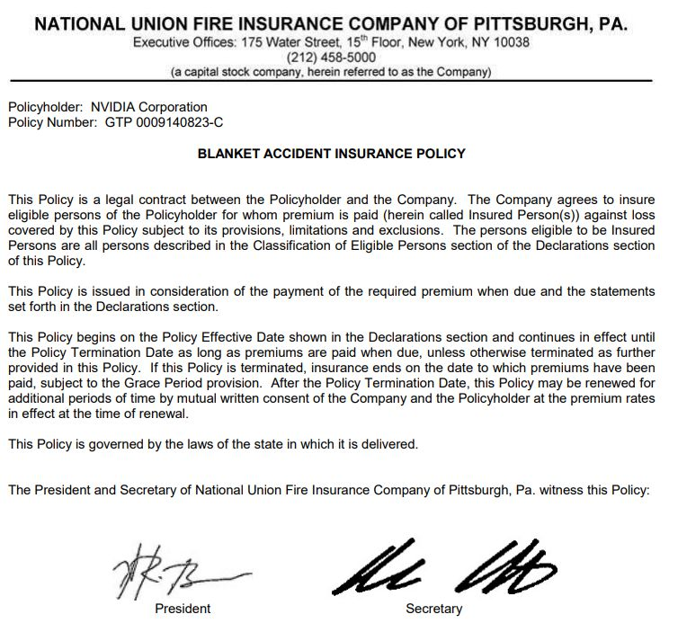
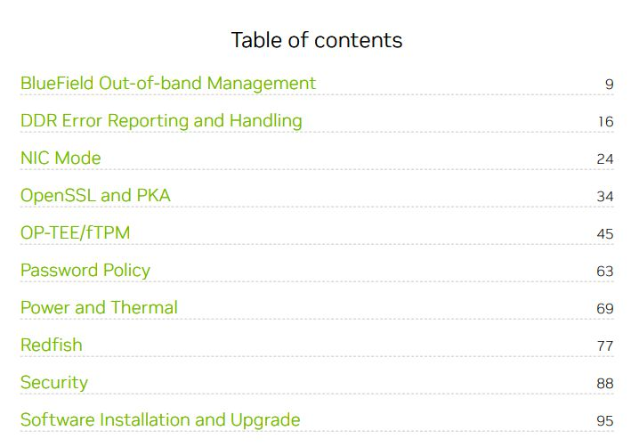
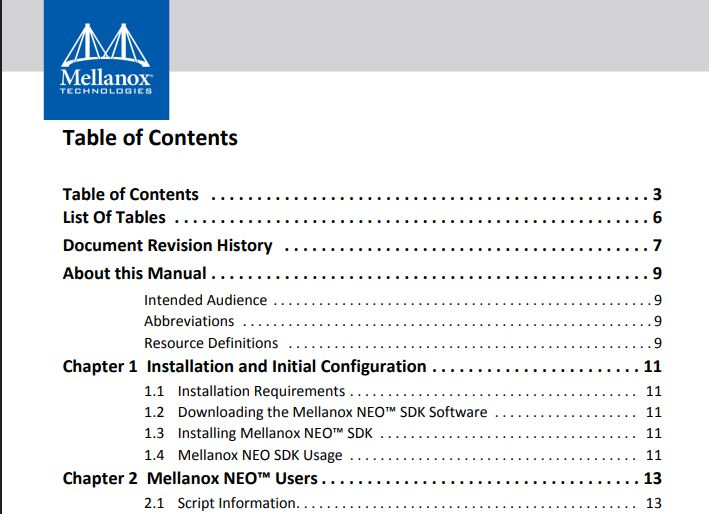

# OSINT - NVIDIA

*Mario García Fernández*

---

## ÍNDICE

- [INTRODUCCIÓN](#introducción)
- [METODOLOGÍA](#metodología)
- [RESULTADOS Y EVIDENCIAS](#resultados-y-evidencias)
  - [Fase A: Presencia en la Web](#fase-a-presencia-en-la-web)
  - [Fase B: Documentos y posibles filtraciones](#fase-b-documentos-y-posibles-filtraciones)
  - [Fase C: Clasificación de la información](#fase-c-clasificación-de-la-información)
- [ANÁLISIS Y CONCLUSIONES](#análisis-y-conclusiones)
- [RIESGO CRÍTICO Y MITIGACIÓN](#riesgo-crítico-y-mitigación)

---

## INTRODUCCIÓN

**Organización seleccionada:** NVIDIA Corporation  
**Dominio principal:** https://www.nvidia.com

NVIDIA es una empresa tecnológica multinacional especializada en el desarrollo de unidades de procesamiento gráfico (GPU), inteligencia artificial y soluciones de computación avanzada.

El objetivo de este informe es realizar un análisis OSINT de su huella digital, utilizando únicamente información pública disponible en Internet, con el fin de identificar posibles riesgos de ciberseguridad derivados de la exposición de información.

---

## METODOLOGÍA

Para la realización de este análisis OSINT se ha seguido una metodología basada en tres fases:

1. **Colección de información:**  
   Se han utilizado herramientas públicas como Google, Wayback Machine y Have I Been Pwned para recopilar datos accesibles sin interacción directa con los sistemas de la empresa.

2. **Procesamiento de la información:**  
   Los datos obtenidos han sido analizados para identificar su relevancia y posible impacto en términos de seguridad.

3. **Análisis:**  
   Se ha evaluado el riesgo asociado a la información encontrada, transformando los datos en inteligencia útil para la ciberseguridad.

Todas las acciones realizadas han sido pasivas y mediante el uso exclusivo del navegador web.

---

## RESULTADOS Y EVIDENCIAS

### Fase A: Presencia en la Web

**Perfiles oficiales encontrados:**

- Twitter (X): https://twitter.com/nvidia
- LinkedIn: https://www.linkedin.com/company/nvidia
- YouTube: https://www.youtube.com/@NVIDIA
- GitHub: https://github.com/NVIDIA

---

#### Fecha de la primera captura

La primera captura disponible del dominio nvidia.com en Wayback Machine data de los años 90 (1996).

#### Descripción

La página web presentaba un diseño mucho más simple en comparación con la actualidad, con una estructura básica, uso limitado de imágenes y centrada principalmente en información corporativa y productos de hardware.

#### Análisis

El acceso a versiones antiguas del sitio web puede revelar información histórica sobre tecnologías, productos y posibles estructuras internas que ya no están visibles en la web actual. Esto puede ser útil para un atacante al identificar tecnologías antiguas o cambios en la infraestructura de la empresa.

---

### Fase B: Documentos y posibles filtraciones

Durante la fase de recopilación de información mediante técnicas OSINT, se han identificado varios documentos pertenecientes a la empresa NVIDIA Corporation accesibles públicamente a través de buscadores.

A continuación, se detallan los documentos encontrados y su análisis de riesgo:

---

#### 1. Documento: Default Passwords and Policies

https://docs.nvidia.com/networking/display/bluefieldbsp4131/default-passwords-and-policies.pdf

Este documento contiene información extremadamente sensible, incluyendo credenciales por defecto utilizadas en sistemas internos. La exposición de contraseñas por defecto supone un riesgo crítico, ya que un atacante podría utilizarlas para acceder directamente a dispositivos o servicios sin necesidad de explotar vulnerabilidades adicionales.

**Riesgo:** Crítico  
**Impacto:** Acceso no autorizado a sistemas internos.

---

#### 2. Documento: Password Policy

https://docs.nvidia.com/networking/display/bfswtroubleshooting/password-policy.pdf

Este documento describe en detalle la política de contraseñas, incluyendo procedimientos de recuperación, comandos internos y comportamiento del sistema ante distintos escenarios.

Entre los aspectos más relevantes se encuentran:

- Uso de una contraseña por defecto ("bluefield") en procesos de recuperación.
- Comandos específicos para el reseteo de contraseñas.
- Información sobre logs internos del sistema.

Aunque no proporciona acceso directo, este tipo de información facilita la comprensión del funcionamiento interno del sistema, lo que puede ser aprovechado por un atacante para desarrollar ataques más avanzados.

**Riesgo:** Medio-Alto  
**Impacto:** Facilita ataques dirigidos y análisis del sistema.

---

#### 3. Documento: Social Media Policy

https://images.nvidia.com/content/includes/gcr/pdf/nvidia-social-media-policy.pdf

Se trata de una política interna que regula el comportamiento de los empleados en redes sociales. El documento está marcado como confidencial, lo que indica que no debería estar accesible públicamente.

Aunque no contiene información técnica, sí proporciona contexto organizativo que puede ser utilizado en ataques de ingeniería social, permitiendo a un atacante crear comunicaciones más creíbles o suplantar la identidad de empleados.

**Riesgo:** Medio  
**Impacto:** Facilita ataques de ingeniería social.

---

#### 4. Documento: Corporate Insurance Policy

https://www.nvidia.com/content/dam/en-zz/Solutions/benefits/documents/2021/blanket-accident-insurance-policy-2021.pdf

Este documento corresponde a una póliza de seguro corporativo. Contiene información administrativa como direcciones físicas, estructura de empleados y datos económicos.

Si bien no representa un riesgo técnico directo, puede ser utilizado para enriquecer perfiles de la organización y apoyar ataques basados en ingeniería social.

**Riesgo:** Medio-Bajo  
**Impacto:** Exposición de información corporativa.

---

#### 5. Documento: SoC Platform (BlueField) – NVIDIA / Mellanox

https://docs.nvidia.com/networking/display/bfswtroubleshooting/soc-platform.pdf

Este documento detalla la arquitectura y funcionamiento de los SoC BlueField, desarrollados por Mellanox y actualmente bajo NVIDIA. Contiene información sobre arranque, gestión de firmware, logs, diagnóstico y depuración del sistema. Incluye instrucciones técnicas, comandos de administración interna y procedimientos de recuperación, lo que podría permitir a un atacante entender la estructura interna del SoC y preparar ataques dirigidos al hardware o firmware.

**Riesgo:** Medio-Alto  
**Impacto:** Exposición de información técnica sensible sobre hardware y firmware que podría ser utilizada para ataques dirigidos o análisis de vulnerabilidades.

---

#### 6. Documento: Mellanox NEO SDK – Gestión de Infraestructura

https://enterprisesupport.nvidia.com/sfc/servlet.shepherd/document/download/0698Z00000c6KsyQAE?operationContext=S1

Este documento pertenece al kit de desarrollo de software Mellanox NEO, que NVIDIA utiliza para la orquestación y administración de sus dispositivos de red. Contiene información sobre instalación, configuración, gestión de usuarios, monitoreo, eventos, tareas y provisión de sistemas. La documentación expone comandos, flujos operativos y estructuras de gestión de los dispositivos, lo que podría facilitar ataques dirigidos o ingeniería inversa sobre la infraestructura de red interna de NVIDIA.

**Riesgo:** Medio-Alto  
**Impacto:** Proporciona detalles operativos y técnicos que podrían ser aprovechados para comprometer la infraestructura de red o comprender el funcionamiento interno de los sistemas administrados por NEO.

---

#### Conclusión

La recopilación de documentos públicos de NVIDIA y Mellanox revela una exposición significativa de información técnica y administrativa sensible. Destacan:

- **Credenciales y políticas internas**, que permiten acceso directo o facilitan ataques dirigidos.
- **Documentos de SoC BlueField**, que detallan arranque, firmware, logs y diagnóstico de hardware, exponiendo información crítica sobre la infraestructura de NVIDIA.
- **Mellanox NEO SDK**, que proporciona procedimientos de gestión, monitoreo y provisión de sistemas, permitiendo comprender la operación interna de la infraestructura de red.
- **Información corporativa y políticas de redes sociales**, útiles para ataques de ingeniería social.

En conjunto, estos hallazgos demuestran una deficiente gestión de la información sensible, especialmente en lo que respecta a documentación técnica de dispositivos y sistemas críticos. Se recomienda implementar controles de acceso estrictos, clasificación de documentos, auditorías periódicas y revisión de fuentes públicas, para minimizar la exposición y reducir el riesgo de ataques dirigidos tanto a nivel técnico como organizativo.

---

### Have I Been Pwned – Comprobación de correos de NVIDIA

- privacy@nvidia.com
- info@nvidia.com

#### privacy@nvidia.com

Aparece en varias filtraciones, incluyendo:

- **Brecha de datos de NVIDIA (febrero 2022):** más de 70.000 correos de empleados y hashes NTLM de contraseñas expuestos.
- Brechas anteriores no relacionadas directamente con NVIDIA (MySpace 2008, BvD 2021, Cit0day 2020, etc.).

**Impacto:** Posible acceso a credenciales antiguas de empleados y riesgo de reuso de contraseñas.

#### info@nvidia.com

Aparece en múltiples filtraciones recientes e históricas:

- **Instagram 2026:** correos asociados a datos públicos de la plataforma.
- **DemandScience 2024:** 122 millones de correos corporativos expuestos, incluyendo puestos y nombres.
- Brechas históricas de otras empresas (Apollo, Collection1, AntiPublic, Adobe…).

**Impacto:** Exposición de correo corporativo y datos relacionados con la empresa, susceptible a phishing o ingeniería social.

#### Conclusión de HIBP

Todos los correos corporativos de NVIDIA revisados han aparecido en alguna filtración histórica, algunas relacionadas directamente con la empresa y otras con bases de datos externas. Esto evidencia que incluso correos públicos pueden estar comprometidos y deben considerarse riesgo medio-alto para ingeniería social y posible ataque de reuso de credenciales.

---

### Fase C: Clasificación de la información

**Información analizada:** resultados de HIBP para los correos privacy@nvidia.com y info@nvidia.com.

**Color asignado:** 🟢 TLP Verde

**Justificación:**

- La información obtenida proviene de fuentes públicas, como filtraciones ya conocidas y datasets accesibles en foros o repositorios.
- No se trata de credenciales activas ni de documentos internos secretos, sino de correos corporativos y datos asociados a brechas históricas.
- Puede compartirse con la comunidad de ciberseguridad para análisis y concienciación sobre riesgos de phishing o reuso de contraseñas.
- Sin embargo, no debería considerarse información totalmente pública para fines comerciales o divulgación masiva, porque sigue vinculada a empleados y correos corporativos.

**Ejemplo práctico de riesgo y recomendación:**

| Dato encontrado | Riesgo | Recomendación |
|---|---|---|
| Correos corporativos de NVIDIA en filtraciones históricas (privacy@nvidia.com, info@nvidia.com) | Posible phishing dirigido, ataques de ingeniería social o uso de credenciales comprometidas. | Informar al equipo interno para concienciación sobre seguridad, habilitar autenticación multifactor (MFA) y no reutilizar contraseñas antiguas filtradas. |

---

## ANÁLISIS Y CONCLUSIONES

El análisis OSINT sobre NVIDIA Corporation ha permitido identificar una exposición significativa de información sensible a través de fuentes públicas. Se han localizado documentos técnicos críticos accesibles desde buscadores, incluyendo credenciales por defecto de dispositivos BlueField y procedimientos internos de recuperación de contraseñas. Además, los correos corporativos revisados (privacy@nvidia.com, info@nvidia.com) aparecen vinculados a múltiples filtraciones históricas, incluyendo la brecha directa de NVIDIA en 2022 con más de 70.000 empleados afectados. La presencia pública de políticas internas marcadas como confidenciales facilita además ataques de ingeniería social contra la organización.

---

## RIESGO CRÍTICO Y MITIGACIÓN

**Riesgo crítico identificado:** La exposición pública del documento *Default Passwords and Policies* representa el riesgo más grave detectado, ya que un atacante podría utilizar las credenciales por defecto documentadas para acceder directamente a dispositivos BlueField sin necesidad de explotar vulnerabilidad alguna.

**Recomendación:** NVIDIA debería retirar inmediatamente de acceso público cualquier documento que contenga credenciales, aunque sean por defecto, e implementar una política de revisión periódica de su huella digital mediante auditorías OSINT internas. Adicionalmente, se recomienda la implantación de autenticación multifactor (MFA) en todos los sistemas y la eliminación o cambio obligatorio de contraseñas por defecto en el proceso de despliegue de dispositivos.
