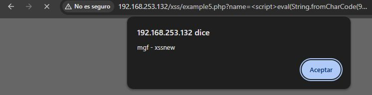

# Ejercicio 2 — XSS Reflejado: Example5 (Web for Pentesters)

## Entorno de prueba

**Plataforma:** Web for Pentesters — PentesterLab  
**Vulnerabilidad:** Cross-Site Scripting Reflejado (XSS-r)  
**Ejemplo:** Example 5 — XSS con filtrado de la función `alert`

---

## Objetivo

Explotar la vulnerabilidad XSS del Example 5 logrando mostrar una alerta con el mensaje **`xssnew`**, a pesar de los mecanismos de filtrado implementados por la aplicación.

---

## Análisis previo — Comportamiento del filtro

A diferencia del Example 1, esta aplicación aplica un filtrado mediante expresión regular (`preg_match`) que **bloquea la cadena `alert`** en el input del usuario. Esto impide la inyección directa de payloads que contengan dicha función.

Al intentar el payload básico:

```html
<script>alert('xssnew')</script>
```

La aplicación bloquea la petición o elimina el término `alert`, impidiendo la ejecución del código.

---

## Técnica de evasión — Codificación con `String.fromCharCode()`

Para evadir el filtro, se construye dinámicamente la llamada a `alert()` a partir de sus valores ASCII, utilizando las funciones `String.fromCharCode()` y `eval()`. De este modo, la cadena `alert` nunca aparece de forma literal en el payload enviado.

**Payload utilizado:**

```html
<script>eval(String.fromCharCode(97,108,101,114,116,40,39,109,103,102,32,45,32,120,115,115,110,101,119,39,41))</script>
```

**Decodificación del payload:**

| Decimal | Carácter |
|---------|----------|
| 97 | a |
| 108 | l |
| 101 | e |
| 114 | r |
| 116 | t |
| 40 | ( |
| 39 | ' |
| 109,103,102,32,45,32,120,115,115,110,101,119 | mgf - xssnew |
| 39 | ' |
| 41 | ) |

El resultado de la decodificación es: `alert('mgf - xssnew')`

---

## Resultado



Al introducir el payload en el parámetro `name`, la aplicación no bloquea la petición —ya que la cadena `alert` no aparece en texto plano— y el navegador ejecuta el código JavaScript inyectado, mostrando la alerta con el mensaje **"mgf - xssnew"**. Esto confirma la explotación exitosa de la vulnerabilidad XSS reflejada.

---

## Justificación del payload

La elección de `String.fromCharCode()` junto con `eval()` responde a una estrategia clásica de evasión de filtros basados en listas negras (blacklists):

- **`String.fromCharCode()`** convierte una secuencia de valores decimales en la cadena de texto correspondiente en tiempo de ejecución, sin que dicha cadena aparezca escrita en el código fuente del payload.
- **`eval()`** interpreta y ejecuta la cadena resultante como código JavaScript válido.

Este enfoque demuestra que los mecanismos de filtrado que operan sobre patrones estáticos son inherentemente insuficientes: cualquier función o cadena puede ofuscarse mediante codificación, y el motor JavaScript se encargará de interpretarla en el momento de la ejecución.

---

## Conclusiones

El Example 5 de Web for Pentesters ilustra cómo un filtrado superficial basado en la detección de cadenas específicas (como `alert`) puede eludirse fácilmente mediante técnicas de ofuscación. La única defensa robusta frente a XSS es la **validación y escapado correctos de la salida**, independientemente del contenido de la entrada.
