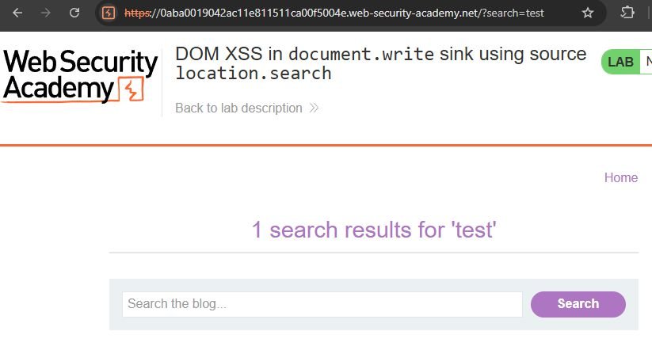
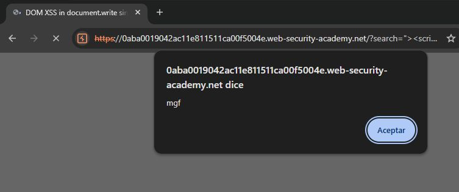

# Ejercicio 5 — DOM XSS (Laboratorio PortSwigger)

## Entorno de prueba

**Plataforma:** PortSwigger Web Security Academy  
**Vulnerabilidad:** DOM-Based Cross-Site Scripting (DOM XSS)  
**Laboratorio:** DOM XSS in `document.write` sink using source `location.search`  
**Dificultad:** Apprentice

---

## Descripción del laboratorio

El laboratorio presenta una aplicación web con funcionalidad de búsqueda. El objetivo es identificar y explotar una vulnerabilidad DOM XSS en la que el valor del parámetro de búsqueda se procesa en el lado del cliente mediante JavaScript y se escribe directamente en el DOM a través de `document.write()`, sin ningún tipo de sanitización.


---

## Proceso de identificación

### Paso 1 — Análisis del comportamiento del buscador

Al acceder al laboratorio se observa que la aplicación dispone de un buscador. Al realizar una búsqueda de prueba, la URL cambia a un formato similar al siguiente, incluyendo el término buscado como parámetro:



### Paso 2 — Inspección del código fuente

Inspeccionando el código fuente de la página se confirma que el valor del parámetro `search` se inserta dinámicamente en el HTML mediante la función JavaScript `document.write()`:

```javascript
document.write('');
```

El valor de `query` se obtiene directamente de `location.search` sin ningún procesamiento previo.



Se confirma que el valor se inserta directamente en el DOM como parte de un atributo HTML de una etiqueta ``, lo que define el contexto de la inyección.

---

## Construcción del payload

Dado que el valor se inserta dentro del atributo `src` de una etiqueta ``, es necesario:

1. **Cerrar la comilla doble** del atributo `src` con `"`.
2. **Cerrar la etiqueta ``** con `>`.
3. **Inyectar una nueva etiqueta `<script>`** con código JavaScript ejecutable.

**Payload utilizado:**

```html
"><script>alert("mgf")</script>
```

**Resultado tras la inyección en el DOM:**

```html
<script>alert("mgf")</script>">
```

El navegador interpreta el código inyectado como HTML válido: cierra el atributo, cierra la etiqueta `` y ejecuta el `<script>` resultante.

---

## Uso de DOM Invader

Para analizar la vulnerabilidad de forma más eficiente se utilizó **DOM Invader**, la herramienta integrada en Burp Suite's browser para la detección automatizada de sinks y sources DOM XSS.

### Configuración

1. Abrir el navegador integrado de Burp Suite.
2. Acceder a la extensión **DOM Invader** en el panel de DevTools.
3. Activar la opción **Inject canary into all sources** para que DOM Invader inserte automáticamente un identificador único en todas las fuentes de datos (URL, formularios, cabeceras, etc.).
4. Navegar por la aplicación y realizar búsquedas.

### Proceso

DOM Invader detecta automáticamente cuando el canary llega a un sink peligroso (en este caso `document.write`). El panel muestra:

- **Source identificada:** `location.search` → parámetro `search`
- **Sink identificado:** `document.write()`
- **Contexto:** Dentro de un atributo HTML de etiqueta ``

Con esta información, DOM Invader sugiere el payload adecuado para explotar el sink según el contexto detectado, lo que acelera significativamente el proceso de análisis frente a la inspección manual del código fuente.

---

## Resultado

La inyección del payload `"><script>alert("mgf")</script>` en el buscador provoca la ejecución del código JavaScript en el navegador, mostrando la alerta y confirmando la existencia de la vulnerabilidad DOM XSS.

---

## Justificación del payload

El payload `"><script>alert("mgf")</script>` se selecciona porque:

- El parámetro `search` se inserta mediante `document.write()` **dentro de un atributo HTML**, por lo que es necesario escapar del contexto del atributo antes de poder inyectar JavaScript.
- El prefijo `"` cierra la comilla del atributo `src` y `>` cierra la etiqueta ``, liberando el contexto para inyectar código HTML arbitrario.
- El uso de `alert("mgf")` permite identificar visualmente la ejecución del script y documenta la prueba de concepto de forma clara.

---

## Diferencias entre DOM XSS y XSS Reflejado/Almacenado

| Característica | DOM XSS | Reflected XSS | Stored XSS |
|----------------|---------|---------------|------------|
| Procesamiento del payload | En el cliente (JavaScript) | En el servidor | En el servidor |
| El payload llega al servidor | No (puede quedar en el fragmento `#`) | Sí | Sí |
| Detectable por WAF/servidor | Difícil | Más sencillo | Más sencillo |
| Persiste en la BD | No | No | Sí |

---

## Conclusiones

La vulnerabilidad DOM XSS en este laboratorio ilustra los riesgos asociados al uso de funciones JavaScript que escriben datos directamente en el DOM sin sanitización previa. A diferencia del XSS reflejado clásico, el payload puede no pasar por el servidor, dificultando su detección mediante mecanismos de seguridad tradicionales como WAFs o filtros del lado servidor. La mitigación requiere el uso de alternativas seguras a `document.write()` (como `textContent` o `createElement`) y la aplicación de una Content Security Policy robusta.
