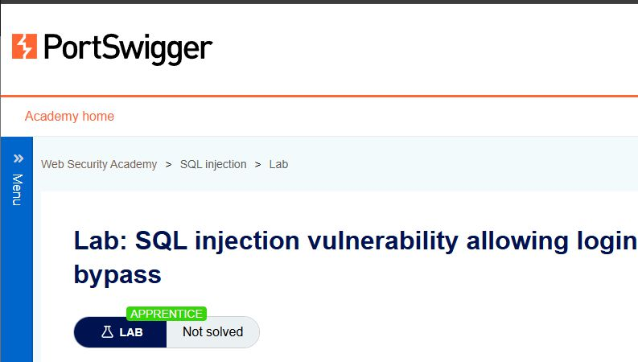
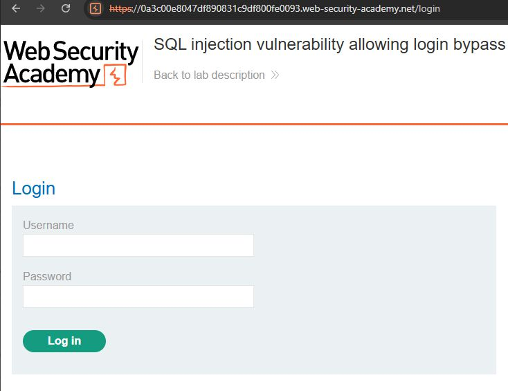
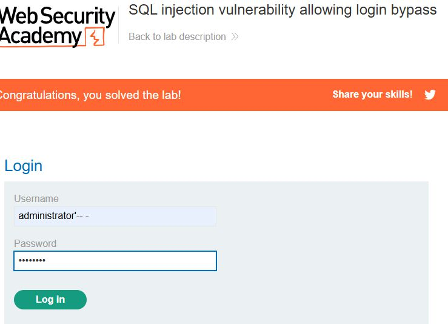
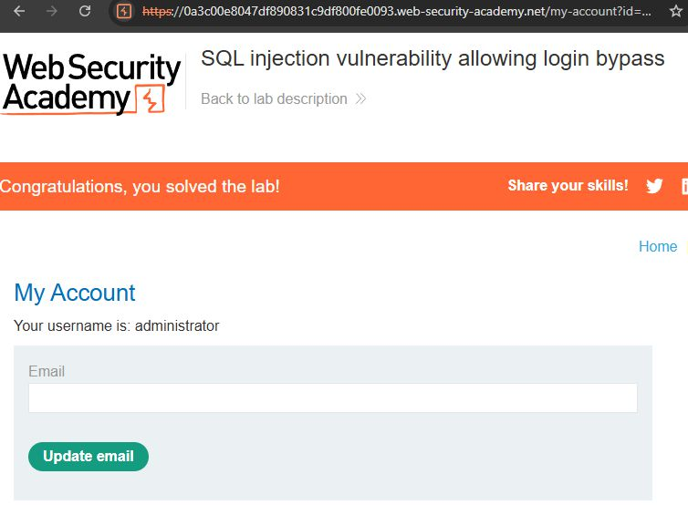

# Ejercicio 6 — Login Bypass mediante SQL Injection (PortSwigger)

## Entorno de prueba

**Plataforma:** PortSwigger Web Security Academy  
**Vulnerabilidad:** SQL Injection — Authentication Bypass  
**Laboratorio:** SQL injection vulnerability allowing login bypass  
**Dificultad:** Apprentice

---

## Descripción del laboratorio

El laboratorio presenta una aplicación web con un formulario de autenticación estándar (usuario y contraseña) que construye las consultas SQL concatenando directamente los valores introducidos por el usuario. El objetivo es acceder a la cuenta del administrador sin conocer su contraseña.



---

## Análisis del formulario de autenticación

Al acceder al laboratorio se observa un formulario con:

- **Campo `username`**
- **Campo `password`**
- **Botón Login**



La consulta SQL ejecutada por la aplicación en el backend tiene presumiblemente la siguiente estructura:

```sql
SELECT * FROM users
WHERE username = 'INPUT_USER'
AND password = 'INPUT_PASS';
```

Dado que los valores se concatenan directamente sin el uso de consultas preparadas, cualquier carácter especial SQL introducido por el usuario modifica la lógica de la consulta.

---

## Proceso de explotación

### Paso 1 — Identificación de la vulnerabilidad

Se introduce una comilla simple (`'`) en el campo de usuario para comprobar si la aplicación genera un error SQL o un comportamiento anómalo. La respuesta confirma que la entrada no está siendo sanitizada.

### Paso 2 — Construcción del payload

El objetivo es lograr que la consulta devuelva el registro del administrador independientemente del valor de la contraseña. Para ello se utiliza un comentario SQL que anula la condición de validación de la contraseña.

**Payload introducido en el campo `username`:**

```
administrator'-- -
```

**Payload en el campo `password`:**

```
cualquiercosa
```

### Paso 3 — Análisis de la consulta resultante

Tras la inyección, la consulta SQL ejecutada por el servidor es:

```sql
SELECT * FROM users
WHERE username = 'administrator'-- -'
AND password = 'cualquiercosa';
```

El símbolo `--` indica el inicio de un comentario en SQL. Todo lo que aparece a continuación queda ignorado por el motor de base de datos. La consulta real ejecutada es:

```sql
SELECT * FROM users
WHERE username = 'administrator';
```

Al existir el usuario `administrator`, la base de datos devuelve su registro y el login se concede sin verificar la contraseña.

### Paso 4 — Acceso como administrador





El laboratorio queda resuelto al acceder correctamente a la cuenta del administrador.

---

## Payloads aplicados

| Campo | Payload | Propósito |
|-------|---------|-----------|
| `username` | `administrator'-- -` | Cerrar la cadena SQL y comentar el resto de la consulta |
| `password` | `cualquiercosa` | Valor arbitrario (ignorado por el comentario SQL) |

---

## Por qué funciona este payload

El payload es efectivo por las siguientes razones:

1. **Cierre de la cadena con `'`:** La comilla simple cierra la delimitación del valor del campo `username` en la consulta SQL, lo que permite inyectar sintaxis SQL adicional.

2. **Comentario con `-- -`:** La secuencia `--` es el delimitador de comentario estándar en SQL (compatible con MySQL, PostgreSQL y otros motores). Todo lo que sigue —incluyendo `AND password = '...'`— queda ignorado. El espacio o carácter `-` final asegura compatibilidad con distintas configuraciones del motor.

3. **Nombre de usuario válido:** Al indicar `administrator` como nombre de usuario, la consulta encuentra el registro y lo devuelve sin necesidad de validar ninguna contraseña.

4. **Ausencia de prepared statements:** La aplicación no utiliza consultas preparadas ni mecanismos de parametrización, lo que hace posible la inyección.

---

## Conclusiones

Este laboratorio demuestra el impacto crítico de las vulnerabilidades de SQL Injection en formularios de autenticación. Un atacante puede obtener acceso a cuentas privilegiadas sin conocer ninguna credencial válida, simplemente manipulando la lógica de la consulta SQL subyacente. La única defensa efectiva es el uso obligatorio de **consultas preparadas** (*prepared statements*) con parámetros enlazados, que separan estructuralmente el código SQL de los datos proporcionados por el usuario.
