# Servidor de OpenVPN con Easy-RSA 3

Guía completa para desplegar un servidor OpenVPN en Debian usando Easy-RSA 3 para la gestión de certificados. El objetivo es montar una infraestructura PKI propia y levantar un túnel VPN seguro entre servidor y clientes.

---

## Índice

1. [Configuración previa](#configuración-previa)
2. [Instalación de OpenVPN y Easy-RSA 3](#instalación-de-openvpn-y-easy-rsa-3)
3. [Creación de la PKI](#creación-de-la-pki)
4. [Configuración de OpenVPN](#configuración-de-openvpn)
5. [Configuración del cliente](#configuración-del-cliente)
6. [Pruebas de conexión](#pruebas-de-conexión)

---

## Configuración previa

Antes de instalar nada, conviene dejar el sistema bien configurado: hostname correcto, IP estática y el archivo `/etc/hosts` apuntando bien.

**Cambiar el hostname:**

```bash
sudo hostnamectl set-hostname mgarfer1604
```

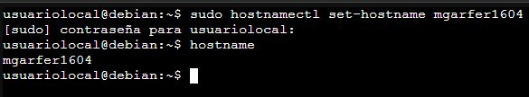

**Configurar red estática en `/etc/network/interfaces`:**

La interfaz `ens18` se configura con IP estática, máscara, puerta de enlace y servidores DNS públicos (Google y Cloudflare):

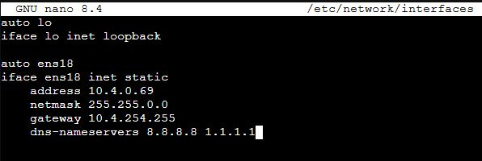

**Configurar `/etc/hosts`:**

Se empareja la IP local con el nuevo hostname para que la resolución interna funcione correctamente:

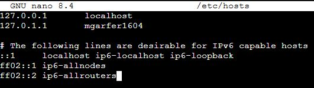

---

## Instalación de OpenVPN y Easy-RSA 3

Instalamos OpenVPN directamente desde los repositorios oficiales de Debian junto con `git`:

```bash
sudo apt install openvpn git -y
```

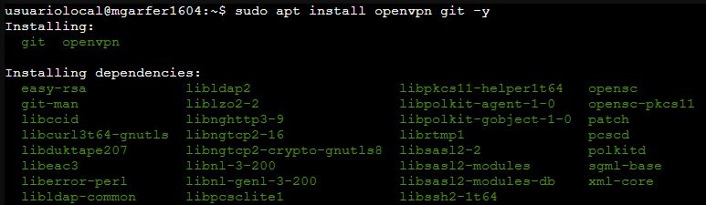

A continuación clonamos Easy-RSA 3 desde el repositorio oficial de OpenVPN en GitHub y accedemos al directorio `easyrsa3`:

```bash
git clone https://github.com/OpenVPN/easy-rsa.git
cd easy-rsa/easyrsa3
```

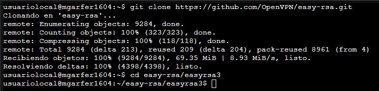

### Configuración del archivo `vars`

Copiamos el archivo de ejemplo `vars.example` como `vars` y añadimos al final los parámetros personalizados:

- Algoritmo de clave: **EC** (curva elíptica)
- Curva: **secp521r1**
- Hash: **sha512**
- Caducidad de la CA: **3218 días** (~9 años)
- Caducidad de los certificados: **1218 días** (~3 años)
- Modo Distinguished Name: **cn_only**

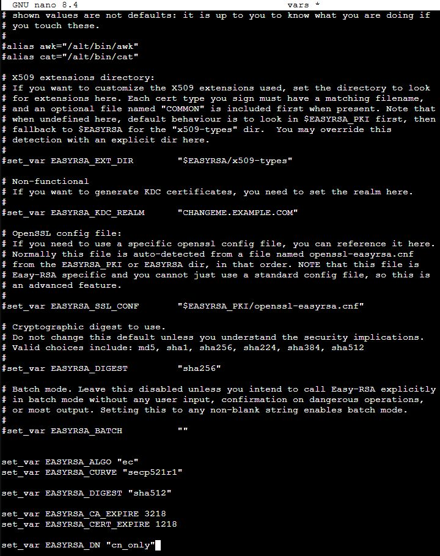

---

## Creación de la PKI

### Inicializar la PKI

```bash
./easyrsa init-pki
```

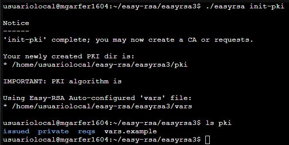

La PKI se crea en `~/easy-rsa/easyrsa3/pki`. Dentro encontramos los directorios `issued/`, `private/` y `reqs/`.

### Crear la Autoridad Certificadora (CA)

```bash
./easyrsa build-ca
```

Se solicita una passphrase para proteger la clave privada de la CA y un Common Name. Una vez completado, el certificado queda en `pki/ca.crt`:

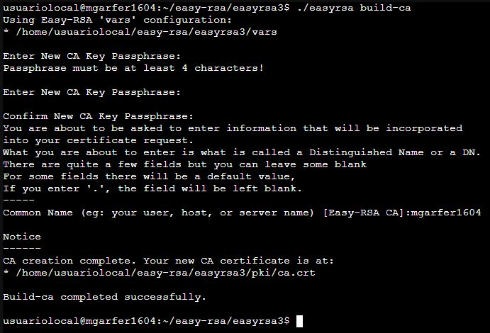

### Firmar el certificado del servidor

```bash
./easyrsa build-server-full servidor-mgarfer1604 nopass
```

El certificado se crea como tipo `server`, con validez de 1218 días, y queda en `pki/issued/servidor-mgarfer1604.crt`:

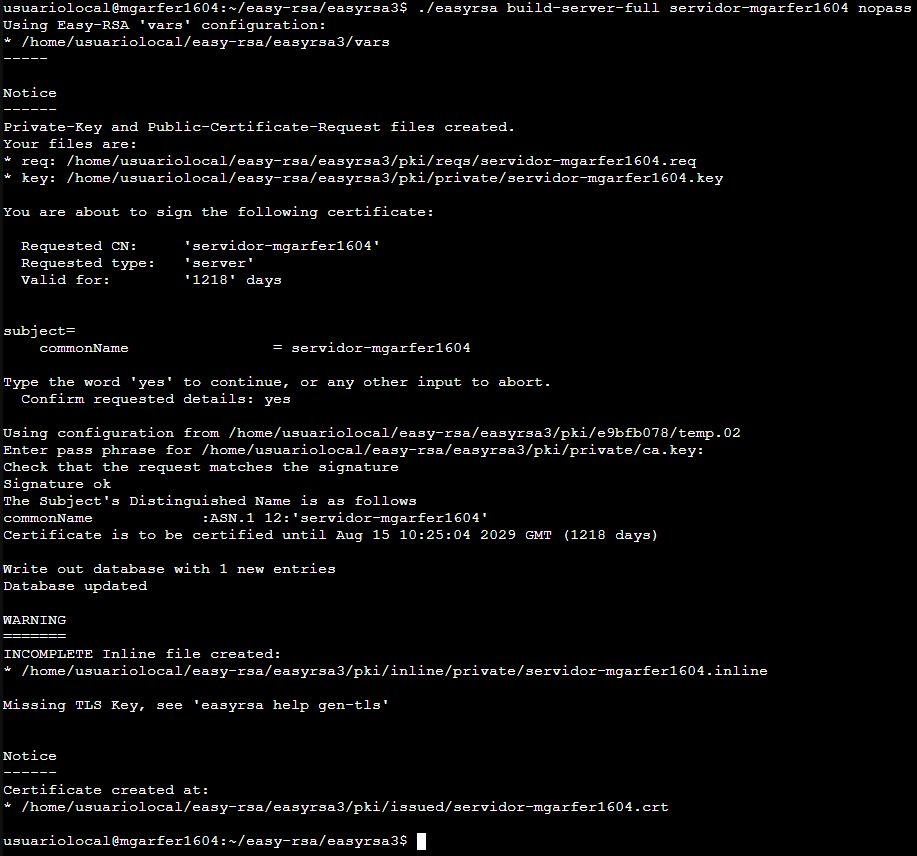

### Firmar el certificado del cliente (alumno)

```bash
./easyrsa build-client-full alumno-mgarfer1604 nopass
```

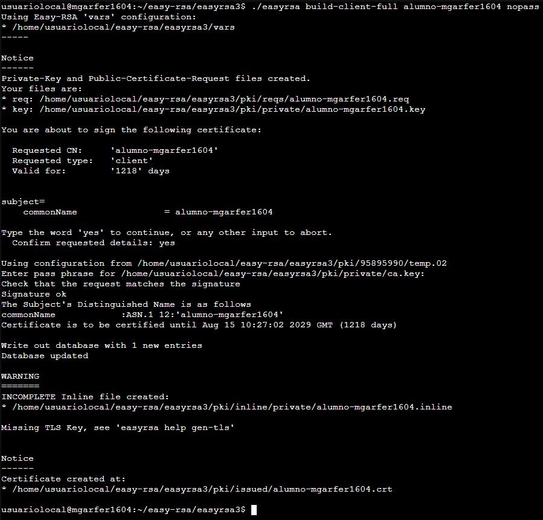

### Firmar el certificado del cliente (profesor)

```bash
./easyrsa build-client-full profesor-mgarfer1604 nopass
```


### Crear la clave TLS (`ta.key`)

Para añadir protección adicional contra ataques DoS mediante TLS Authentication, generamos la clave `ta.key`. Primero nos aseguramos de que el binario de OpenVPN esté en el PATH:

```bash
export PATH=$PATH:/usr/sbin
openvpn --genkey secret ta.key
```

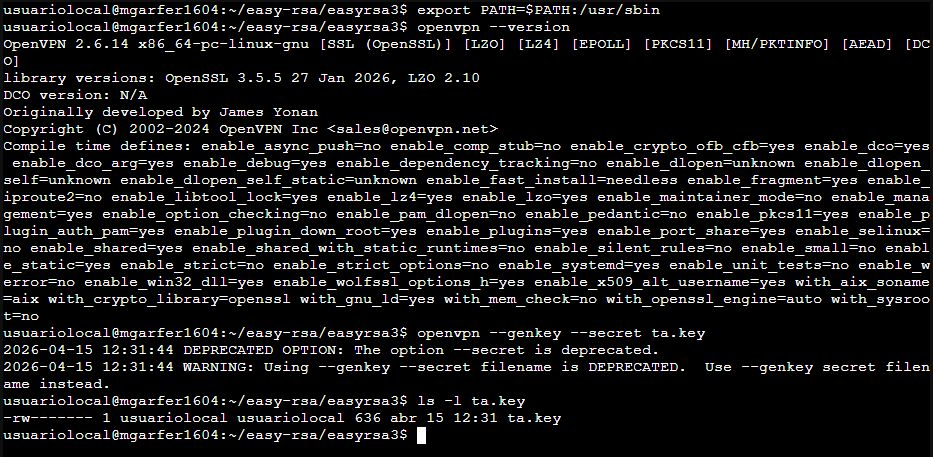

> **Nota:** En versiones recientes de OpenVPN el flag `--secret` aparece como deprecado en el output, pero el resultado es igualmente válido. El fichero `ta.key` se genera correctamente.

---

## Configuración de OpenVPN

### Estructura de carpetas y copia de certificados

Creamos tres directorios para organizar los certificados por rol y copiamos los ficheros correspondientes a cada uno:

```bash
mkdir -p vpn/servidor vpn/alumno vpn/profesor
```

```
~/vpn/
├── servidor/   → ca.crt, servidor-mgarfer1604.crt, servidor-mgarfer1604.key, ta.key, dh.pem
├── alumno/     → ca.crt, alumno-mgarfer1604.crt, alumno-mgarfer1604.key, ta.key
└── profesor/   → ca.crt, profesor-mgarfer1604.crt, profesor-mgarfer1604.key, ta.key
```

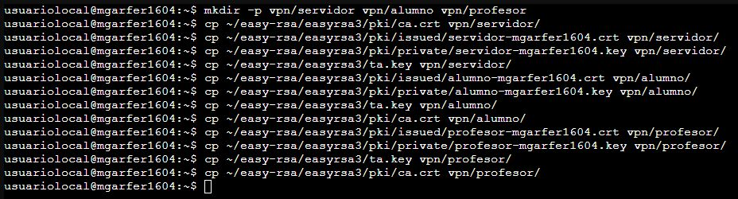

### Archivo `server.conf`

Creamos `/etc/openvpn/server.conf` con la configuración del servidor:

```ini
port 11218
proto udp
dev tun

ca /home/usuariolocal/vpn/servidor/ca.crt
cert /home/usuariolocal/vpn/servidor/servidor-mgarfer1604.crt
key /home/usuariolocal/vpn/servidor/servidor-mgarfer1604.key
tls-crypt /home/usuariolocal/vpn/servidor/ta.key

server 192.168.218.0 255.255.255.0

keepalive 10 120

cipher AES-256-GCM
auth SHA512

;compress

persist-key
persist-tun

status /var/log/openvpn-status.log
verb 3
```

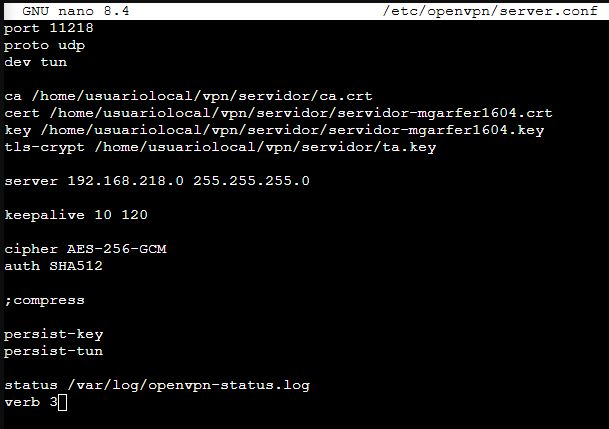

> La directiva `compress` se deja comentada para evitar el ataque VORACLE.

---

## Configuración del cliente

### Archivo `cliente.ovpn`

```ini
client
dev tun
proto udp

remote 10.4.0.69 11218

resolv-retry infinite
nobind

persist-key
persist-tun

ca ca.crt
cert alumno-mgarfer1604.crt
key alumno-mgarfer1604.key
tls-crypt ta.key

cipher AES-256-GCM
auth SHA512

verb 3
```

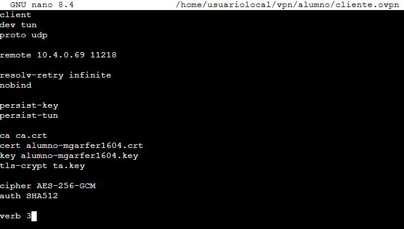

### Generar parámetros Diffie-Hellman

```bash
./easyrsa gen-dh
```

Genera el archivo `pki/dh.pem` con parámetros DH de 2048 bits:

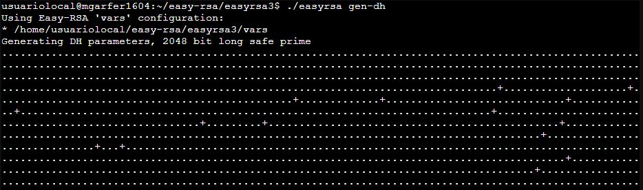

### Copiar `dh.pem` a la carpeta del servidor

```bash
cp pki/dh.pem ~/vpn/servidor/
```

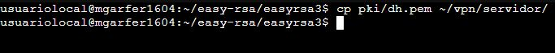

### Añadir `dh.pem` al `server.conf`

Se añade la línea `dh` al fichero `server.conf` apuntando al fichero generado:

```ini
dh /home/usuariolocal/vpn/servidor/dh.pem
```

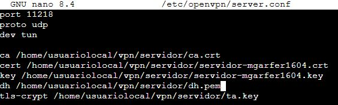

---

## Pruebas de conexión

### Arrancar el servidor

```bash
sudo openvpn --config /etc/openvpn/server.conf
```

El servidor inicializa correctamente: carga los parámetros DH, levanta la interfaz `tun0` y queda a la escucha en el puerto UDP 11218. La secuencia finaliza con `Initialization Sequence Completed`:

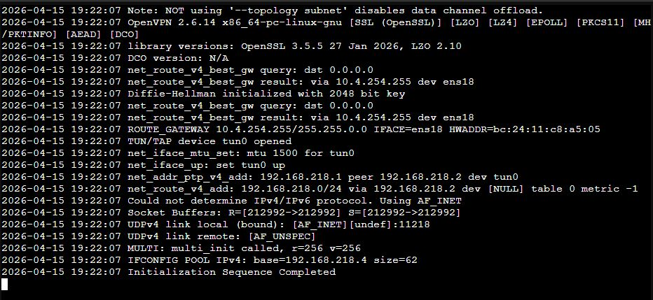

### Verificar la interfaz VPN en el servidor

```bash
ip a
```

La interfaz `tun0` aparece con la IP `192.168.218.1/32` y el peer `192.168.218.2`, confirmando que el servidor está correctamente levantado:

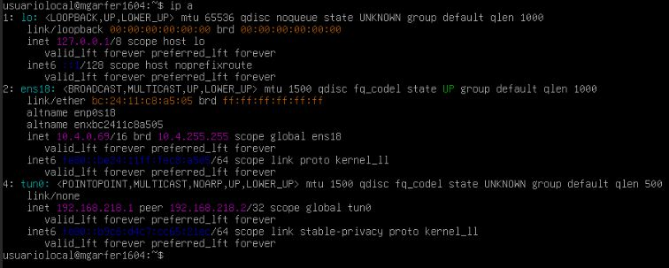

### Conectividad básica desde el cliente

Desde la máquina cliente comprobamos primero conectividad básica con ping al servidor antes de establecer el túnel:

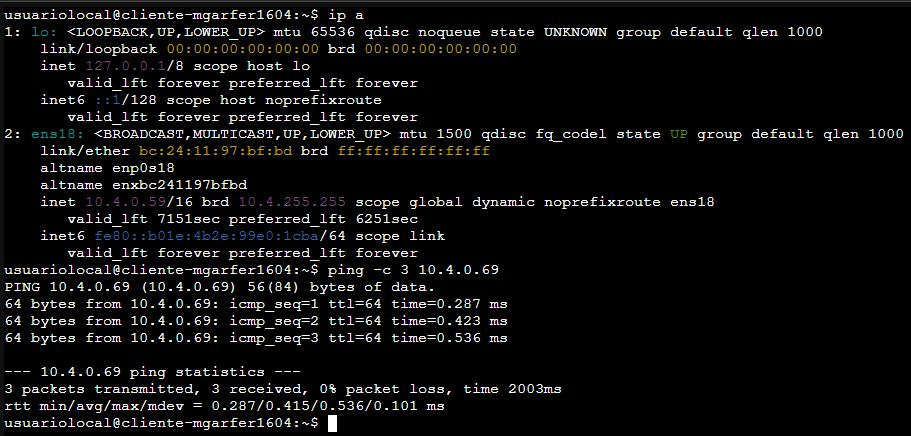

### Transferir archivos de configuración al cliente

Copiamos los certificados y el fichero de configuración al cliente vía SCP:

```bash
scp usuariolocal@10.4.0.69:/home/usuariolocal/vpn/alumno/* .
```

El cliente recibe `alumno-mgarfer1604.crt`, `alumno-mgarfer1604.key`, `ca.crt`, `cliente.ovpn` y `ta.key`:

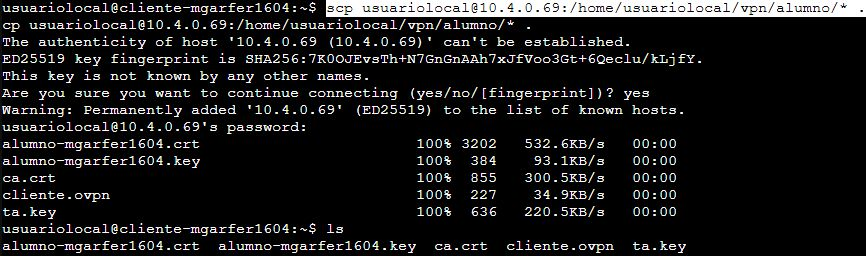

### Conectar el cliente al servidor VPN

```bash
sudo /usr/sbin/openvpn --config cliente.ovpn
```

El cliente negocia TLS correctamente con el servidor (TLSv1.3, AES-256-GCM, secp521r1), la conexión se promueve a `trusted` y la secuencia de inicialización completa con éxito. La interfaz `tun0` obtiene la IP `192.168.218.6/32`:

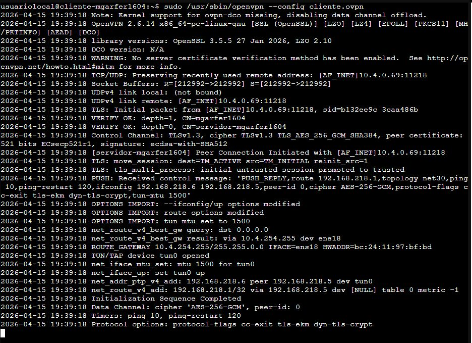

### Verificar conectividad VPN

Con el túnel activo, realizamos ping desde el cliente hacia la IP VPN del servidor (`192.168.218.1`). Los 8 paquetes enviados se reciben sin pérdida de paquetes:

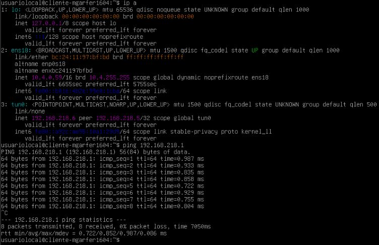

---

## Resumen de la infraestructura

| Componente | Detalle |
|---|---|
| Sistema operativo | Debian 13 (sin GUI) |
| Software VPN | OpenVPN 2.6.14 |
| Gestión de certificados | Easy-RSA 3 |
| Algoritmo de clave | EC (secp521r1) |
| Cifrado del túnel | AES-256-GCM |
| HMAC | SHA-512 |
| Protección DoS | TLS-Crypt (`ta.key`) |
| Puerto | UDP 11218 |
| Subred VPN | 192.168.218.0/24 |
| IP servidor (VPN) | 192.168.218.1 |
